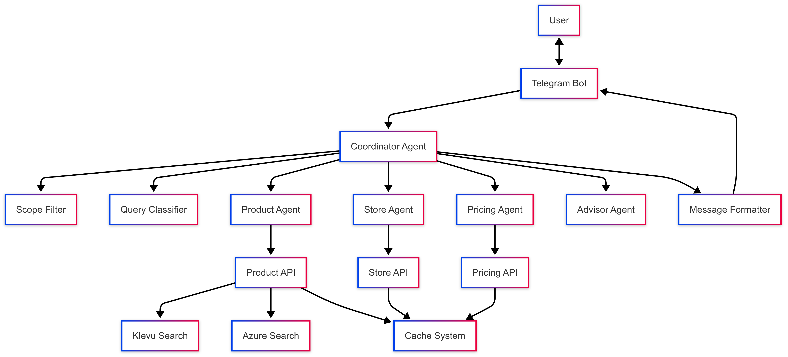

# Pool Equipment Chat Agent

A Telegram-based chat agent for handling pool equipment queries using an agentic approach with CrewAI and Model Context Protocol.

## Features

- Handles pool equipment queries, store details, and product information
- Uses an agentic approach to dynamically determine which API(s) to use
- Integrates with Telegram messaging platform
- Uses GPT-4o for natural language understanding and generation
- Optimizes response times and minimizes unnecessary API calls
- Implements strict scope filtering to stay within the pool equipment domain

## Architecture

The system uses a multi-agent architecture with a coordinator-specialist pattern:

<p align="center">
  
</p>

## Project Structure

```
├── pool_equipment_agent/        # Main application package
│   ├── api/                     # API integration layer
│   │   ├── __init__.py
│   │   ├── base.py              # Base API client with common functionality
│   │   ├── product_api.py       # Product search and details API wrapper
│   │   ├── store_api.py         # Store location API wrapper
│   │   ├── pricing_api.py       # Pricing API wrapper
│   │   └── health_api.py        # Health check API wrapper
│   │
│   ├── agents/                  # Agent definitions
│   │   ├── __init__.py
│   │   ├── base_agent.py        # Base agent class
│   │   ├── product_agent.py     # Product search agent
│   │   ├── store_agent.py       # Store location agent
│   │   ├── pricing_agent.py     # Pricing agent
│   │   ├── advisor_agent.py     # Technical advisor agent
│   │   └── coordinator.py       # Agent coordinator using CrewAI
│   │
│   ├── llm/                     # LLM integration
│   │   ├── __init__.py
│   │   ├── gpt4o.py             # GPT-4o client
│   │   ├── prompt_templates.py  # Prompt templates for different query types
│   │   └── query_classifier.py  # Query intent classification
│   │
│   ├── messaging/               # Messaging platform integration
│   │   ├── __init__.py
│   │   ├── telegram_bot.py      # Telegram bot implementation
│   │   └── message_formatter.py # Message formatting utilities
│   │
│   ├── utils/                   # Utility functions
│   │   ├── __init__.py
│   │   ├── config.py            # Configuration management
│   │   ├── logger.py            # Logging utilities
│   │   └── cache.py             # Caching utilities
│   │
│   ├── app.py                   # FastAPI application
│   ├── main.py                  # Application entry point
│   ├── requirements.txt         # Project dependencies
│   └── .env.example             # Example environment variables
│
├── .gitignore                   # Git ignore file
├── setup.py                     # Package setup file
├── case-study.md                # Case study documentation
└── README.md                    # Project documentation
```

## Setup Instructions

1. Clone the repository
   ```bash
   git clone https://github.com/priyamthakkar2001/Instalily-Final-Round.git
   cd Instalily-Final-Round
   ```

2. Create a virtual environment
   ```bash
   python -m venv venv
   ```

3. Activate the virtual environment
   - Windows:
     ```bash
     venv\Scripts\activate
     ```
   - macOS/Linux:
     ```bash
     source venv/bin/activate
     ```

4. Install dependencies
   ```bash
   pip install -r pool_equipment_agent/requirements.txt
   ```

5. Create a `.env` file in the pool_equipment_agent directory
   ```bash
   cp pool_equipment_agent/.env.example pool_equipment_agent/.env
   # Edit the .env file to add your API keys
   ```

6. Run the application
   ```bash
   cd pool_equipment_agent
   python main.py
   ```

## Telegram Bot Setup

1. Create a new bot on Telegram using BotFather
2. Get your bot token and add it to the `pool_equipment_agent/.env` file
3. Start the application to connect the bot to your server

## Development

- Use `python -m uvicorn app:app --reload` for development with hot reloading
- Run tests with `pytest`

## API Integration

The application integrates with the following APIs:
- Klevu search for simple keyword-based product searches
- Azure search for complex semantic searches
- Product details API for retrieving product information
- Store location API for finding nearby stores
- Pricing API for retrieving product pricing information

## Example Queries

The chatbot can handle a variety of pool equipment queries, such as:

- "What's the best pool filter for a 15,000 gallon pool?"
- "Show me information about Hayward Super Pump"
- "How much does a sand filter cost?"
- "Where is the nearest store to Miami?"
- "What are the hours for branch 726?"
- "How often should I clean my pool filter?"
- "Can you show me an image of part LZA406103A?"
- "What's the difference between chlorine and saltwater pools?"

## Scope Filtering

The system implements comprehensive scope filtering to ensure the chatbot stays strictly within the pool equipment domain. This includes:

- Pattern-based recognition using regular expressions
- Keyword matching for pool-related terminology
- Special handling for product codes and technical terms
- Multiple filtering layers with safeguards against false positives

This ensures users receive helpful responses for legitimate pool equipment queries while maintaining a focused domain expertise.
